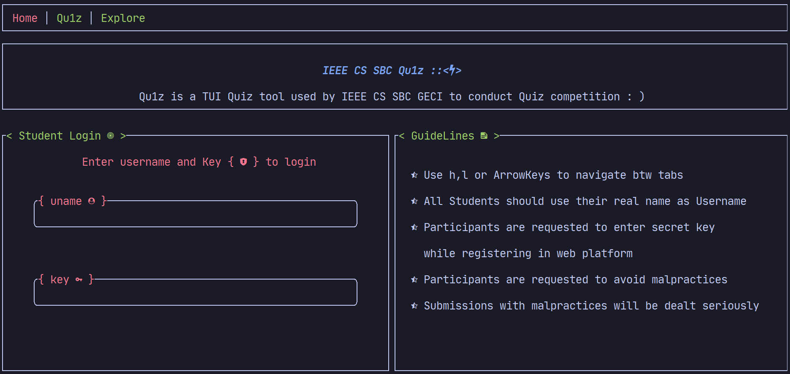
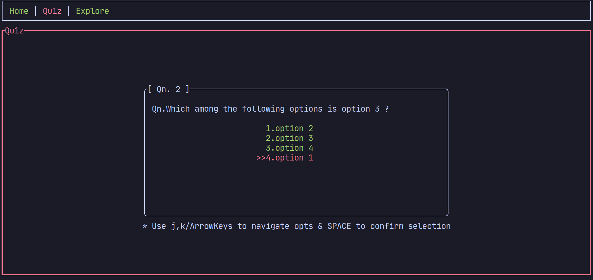

# VQu1z (WiP)

**VQu1z** 
 is a TUI Quiz application which helps to conduction mcq Quiz . 
<br>
Vqu1z consists of : 
-  Vqu1z server where the qns along with answers are uploaded to DB.
- Vqu1z TUI client consists of  

    - **Home Page**

        - Banner
        - User Login
        - Guidelines
<br>



- **Quiz Page**

	- Questions along with optiones are fetched from the server.
	- Answers are send to the server and validated in the real time.
    - after end of Quiz Score is provided.
<br>



- **Explore Page**
    - displays info and descriptions related to event i.e leaderboards, or info on other events etc.

## Current Features
- Display UI based on [test.json](/test.json)  file
- in case of error in serialization displays default response : )
- Supports Vim Keybindings : )
<br>

## Todo

- Implement Quiz Server  and Client API
- better UI
- UX & Performance Improvements

## Installation
 - build from source : ) 

## Build   
- Requires [rust build tools](https://www.rust-lang.org/tools/install).

```bash
  cargo build
```
